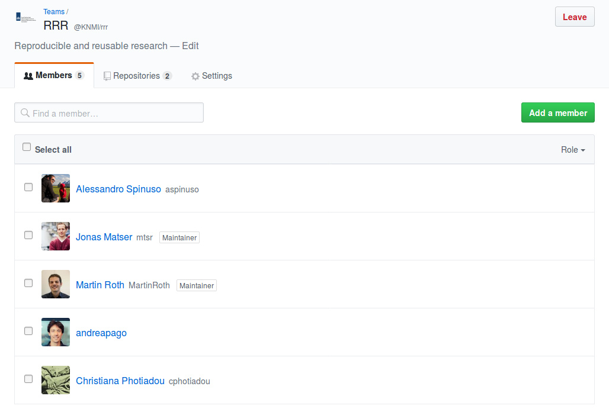

The Research Code of Conduct (RCC)
========================================================
author: The RRR team
date: 1. June 2017
autosize: true

Motivational examples
========================================================

- my own paper
- Earthquake hazard
- KNMI'14 scenario brochure
- many more ...

Aim
========================================================

With the research code of conduct (RCC) we set standards, that should **help**
increase the reproducibility and reusability of the departmental research.

- reproducibility: you / your colleagues / others can reproduce your study
- reusability: you / your colleagues / others can reuse your methods (without a
  lot of copying & pasting)

It is not necessary to reach everything immediately, but the direction should be
clear.

Contents
========================================================

- Version control
- Repository management
- Data management
- Writing
- Coding standards
- Additional sugar

Version control
========================================================
incremental: true

Do you recognize this?

revision.doc<br>
final.doc<br>
final2.doc

Then you are doing it wrong! It should be:

manuscript_v01.doc<br>
manuscript_v02.doc<br>
manuscript_v99.doc

Or **much** better use a real version control system, aka **git**!

Git
========================================================
The core of reproducibility  is a working version control system.

A version control system also works as a kind of lab book, e.g.
[RCC commits](https://github.com/KNMI/RCC/commits/master).

Version control (aka git for us) should be implemented right from the start.

A good start point are the [git basics](https://git-scm.com/videos).


Recommendations
========================================================

Public repos should be stored on the [KNMI github](https://github.com/KNMI)
account

Private repos (for a limited amount of users) can be obtained for free at
[bitbucket](https://bitbucket.org/product)

If your do not know how to use git yet, any
[member](https://github.com/orgs/KNMI/people) of the KNMI github account
should be able to help you.

Repository management
========================================================

Try to structure your repository or research project folder.
Within a repository you will encounter frequently:

 - data (for all local data)
 - figures (for your plots)
 - scripts
 - R (if you define R functions)
 - src (for source code)
 - tests

Data management
========================================================

For external data create a [data management
plan](http://www.wur.nl/nl/show/What-is-a-Data-Management-Plan.htm).

If not, the following rule still applies:

**Try not to copy and paste data and instead use scripts to obtain data**
(and keep those scripts under version control).

This looks simpler than it is, but if we work together that should become easier
over time.
Feel free to consult [us](https://github.com/orgs/KNMI/teams/rrr) if you
experience difficulties.

Writing
========================================================

Git is not only for programmers.
As it is usually a long way from initial idea to a published paper, a lot of
knowledge vanishes when the changes between versions are not documented.

Generic reports or *literate programming* as facilitated by markdown and latex
help to keep everyting together.

[Sharelatex](https://www.sharelatex.com/) allows colaboratinve writing and
tracks document history.

[Pandoc](http://blog.martinfenner.org/2014/08/25/using-microsoft-word-with-git/)
allows to show even the differences between word files.


Note on literate programming
========================================================

```r
plot(rnorm(100))
```


Coding
========================================================

Try to split your script into functions, as a rule of thumb:

**If you copy & paste code three times, it is time to write a function...**

Collections of such functions can be used also by your colleagues...

In order to make your code more readable for others, it is very useful to use
some consitent coding style:

- Python: [PEP8](https://www.python.org/dev/peps/pep-0008/)
- R: [tidyverse](http://adv-r.had.co.nz/Style.html) or
  [google](https://google.github.io/styleguide/Rguide.xml)

Testing your functions automatically raises code quality.

Sugar on top?
========================================================

The following links can help to improve reproducibility and reusability even
more:

- [docker](https://www.docker.com/) for even more reproducibility
- [provenance](https://www.w3.org/TR/prov-dm/) Introduction to the concept of
  provenance and traceability according to W3C.
- [dispel4py](https://github.com/dispel4py/dispel4py) processing library and
  workflows (https://github.com/aspinuso/wps_workflow)
- [jupyter](https://jupyter.org/) for live notebooks
- [doxygen](https://en.wikipedia.org/wiki/Doxygen) for easy documentation
  / R-users should have a look at
  [roxygen2](https://cran.r-project.org/web/packages/roxygen2/index.html)
- [travis CI](https://travis-ci.org/) for automatic checking
- [codecov](https://codecov.io/) for test coverage

Example: knmitransformer
========================================================

[Initial commit](https://github.com/MartinRoth/knmitransformer/tree/59845b5934b92899eec3c88a41c5eb0121cccbee)

[Current status](https://github.com/MartinRoth/knmitransformer)

[Milestones](https://github.com/MartinRoth/knmitransformer/milestones)

[Travis CI](https://travis-ci.org/MartinRoth/knmitransformer/branches)

The RRR team
========================================================



Some fresh blood is needed ...


